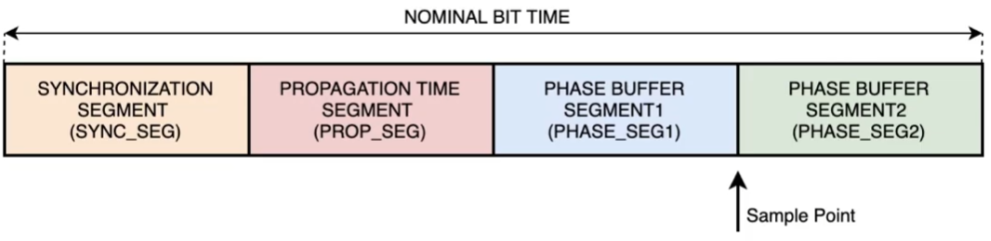

# What is CAN ?

It is a serial, multi-master, message broadcast system developed by Bosch. It's considered asynchronous as each node can send any time on the bus. Its speed varies between 20Kbit/s to 1Mbit/s.

# CAN in the OSI model (ISO11898)

- Physical layer 
	- CAN Transceiver (bus line, electrical specs, connections)
		- Bit timing
		- Bit encoding
		- Synchronization
- Data link layer
	- CAN Controller (includes physical signaling)
		- Medium Access Control
			- Arbitration
			- ACK
			- Error D/C
			- Signal
			- Fault confinement (self check for distinguishing short disturbances from permanent failures on the bus)
		- Logic Link Control
			- Message filtering
			- Overload notification
			- Recovery management

---
# CAN Bus signals

- If MCU does not support CAN by having a CAN Trcv, it only needs the CAN controller which outputs TX & RX at TTL levels to the CAN Trcv, which then transforms the data into CANH & CANL.

- CAN operates on differential signals using CANH and CANL lines.
- CANH, L are always opposite in state. 
	- Logic Low (0) -> CANH-CANL > 0.9v (Dominant state)
	- Logic High (1) -> CANH-CANL < 0.5v (Recessive state)

	- 0.5v < CANH - CANL <0.9v -> **Undefined**
- The idle state of the bus is dominant state (Logic low)
---
# CAN basic concepts

- Any connected node to the network can receive the message if it is interested in it (message filtering)
- The identifier describes the meaning of the data not destination
- The identifier defines static priority.
- Bus access conflict is resolved by bitwise arbitration using the identifier.
	- ex.: 
		-  Sender 1: 1100
		-  Sender 2: 1110 
 Bus content: 1 1 0 0 -> sender 1 wins the bus access
- CAN uses bit stuffing after *5* consecutive bits of identical value (either 0 or 1)
- CAN uses CRC to check for data corruption
---
# CAN Frames
### Standard Frame (high priority than ex)
Uses 11 bit identifier
### Extended frame
Uses 29 bit identifier

## Types

### Data frame
- Contains actual data from transmitter to receiver
### Remote frame
- Exactly like data frame but without data.
- Transmitted by a node which requests transmission of the data from another node (Uses the same identifier)
	- Example:
		- Node 3 wants temperature data, sends remote frame with ID = 5
		- Node 2 is the one responsible for temperature data, it sees a request on the  bus with ID = 5 (it filters ID 5 messages)
		- Node 2 sends temperature data on the bus in a data frame using ID = 5 
### Error frame
- Sent by any node which detects a bus error.
- Used for signaling other nodes if bus error occurs.
### Overload frame
- Used to provide extra delay between data or remote frames for slow receivers.

_Note: For data & remote frames, each frame must be separated by an **interframe space** except if the preceeding frames are overload or error frames _
Example:
	**IFS** | Data frame | **IFS** | Remote frame | **IFS** | Data frame (has error) | Error fame

---

# CAN Frame format
## Data frame
![[Pasted image 20221105132556.png]]
- RTR
	- 0 Frame is not remote frame
	- 1 Frame is remote frame
- RTR is useful if both nodes are sending data (one is remote and one is data with same ID), the data frame wins bus arbitration and data is sent successfully.
- SRR
	- Always '1' (recessive)
	- Makes extended frame format lower priority since RTR is 0 if it is data frame, so standard frame wins bus arbitration.
- IDE
	- 0 Frame is standard frame
	- 1 Frame is extended frame
- IDE is useful if two nodes are sending remote(std) ext(data), IDE will be 0 in std frame, so std format will have higher priority and wins bus arbitration.
- rX bits are reserved bits
- DEL is a de-limiter bit

## Error frame
![[Pasted image 20221105132633.png]]
![[Pasted image 20221105133120.png]]
- Node A detected by monitoring its own bus signals.
- Node B detected the error by detecting bit stuffing violation CAUSED by Node A.
- Error frame is based on violating the bit-stuffing condition by sending 6 consecutive dominant bits, so other nodes will detect that an error has occurred on the bus.

## Interframe space

![[Pasted image 20221105133313.png]]

- Any node which wants to start/continue data transmission, it must detect that the bus is idle after the 3 intermission bits.
- Overload frame (dominant) is sent immediately after the data or remote frame, even before the intermission bits.
## Overload frame
![[Pasted image 20221105133921.png]]
__Must be started on the first bit time of expected intermission bit. Otherwise, it cannot be sent.__
Example:
	Data frame | Overload frame
	-------------| Expected bit 1 of Intermission bits
- If 3rd bit ITM is dominant (0), it is interpreted as SOF bit for a new frame.
It is transmitted in 3 cases:
	1. Internal conditions of receiver which requires delay of incoming data/remote frames.
	2. Detection of a dominant bit at the first & second bit of intermission
	3. If a CAN node samples a dominant bit at the last (8th) bit of an error delimiter or overload delimiter.

## Error types

- Bit error
	- Bit value monitored is different from the actual bit that is sent (except during arbitration or ACK slot)
- Stuff error
	- Detecting 6 consecutive equal bit level in a message field (CRC delimiter, ACK, EOF)
	- Error & overload frames are not stuffed.
- CRC error
	- Receiver calculates CRC and result is not the same as received CRC sequence.
-  Form error
	- Occurs when one or more illegal bits are found in fixed form bit field
	- For a receiver, a dominant bit in the EOF is not a form error
- Acknowledgement error
	- Detected when a transmitter does not monitor a dominant bit during ACK slot.

## Fault confinement

### Unit states

- Error active: Node can participate normally in bus communication and sends an active error flag when error is detected.
- Error passive: Node can participate normally in bus communication, but when an error has been detected, only a passive error flag is sent. (does not affect the bus if nodes are sending while the node is sending an error flag because it is a recessive flag). This node will also wait suspend transmission before initiating further transmission.
- Bus Off: Not allowed to participate on the bus.

## Error counts

- Receive error count *(REC)* 
	- + 1 
		- Receiver detects error
	- + 8
		- Receiver detects error during sending of active error/overload flag
			- ex. 0001 <--- Detecting 1 during sending dominant 0, so it must be an internal error in the receiver circuits.
		- Receiver detects a dominant bit as the first bit after sending an error flag ( even though it should detect recessive bits (1's))
		- Dominant bits are detected after an error/overload flag.
			- ex. Error flag:   0 0 0 0 0 0 1 1 1 1 1 1 1 x
				- Sending 6 dominant & 7 recessive
				- x must be recessive also, so if it is dominant, an error occurred
	- - 1
		- Receiver received a message without error (up to ACK slot) successfully and sending the ACK successfully
	__Notes
	- If REC is already 0 and decremented, it stays 0
	- If REC is 127 and incremented, it gets set to a value between __119 & 127__.

- Transmit error count *(TEC)*
	- + 8
		- When a transmitter sends an error flag
		- Transmitter detects a bit error while sending an active error/overload flag.
			-  ex. 0001 <--- Detecting 1 during sending dominant 0, so it must be an internal error in the transmitter circuits.
		- When many dominant bits are detected after error/overload flag.
	- - 1
		- Frame transmission was successful and getting ACK.
---
## Node states & error counts

#### Error active
- TEC < 128 and REC < 128
- Good transmitter and receiver
#### Error passive
- TEC > 127 or REC > 127
- Bad transmitter or bad receiver
#### Bus off
- TEC >= 256
- Very bad transmitter
- Bus off can become error active after the node monitors 128 occurrences of 11 consecutive recessive bits.
- A bus with *one node*, it will transmit without acknowledgment, then it will become error passive not bus off (can happen in case of powered off devices or plug & play devices)

### Bit timing requirements

$$
Nominal~Bit~Time = \frac{1}{Bit~Rate} 
$$

- **SYNC_SEG** Used to synchronize the various nodes on the bus, the edge is expected to lie within this segment
- **PROP_SEG** Used to compensate for physical delay times within the network
- **PHASE SEG1,2** Used to compensate for edge phase buffers (helps in correct sampling)

![[Pasted image 20221105145920.png]]

- Time quantum must be an integer
- SYNC SEG can only be +/- 1
- If a delay in a bit edge increases, we increase the length of PHASE SEG1 to shift the sample **point right**.
- If a bit edge arrives before we expect it, then we should decrease PHASE SEG2 to shift the sample **point left**.

# CAN in STM
## Features
- Supports version 2.0 A(standard) & B(extended)
- Transmission
	- 3 Transmit mailboxes
	- Transmit priority
	- Time stamp on SOF transmission
- Reception
	- Two receive FIFOs with 3 stages
	- Filtration of messages
## Modes

![[Pasted image 20221106093241.png]]

### Sleep
	SLAK = 1
	INAK = 0
	Entered by: Setting SLEEP in MCR
	Exited by : Clearing SLEEP in MCR
- When the HW is reset, the CAN is in sleep mode
- When in sleep mode, the internal pull-up resistor is activated
- This mode can be entered from any mode by setting the SLEEP bit in the MCR register
- In this mode, the CAN clock is stopped but mailboxes are accessible
- Exiting sleep mode to normal mode requires clearing the SLEEP bit.

### Normal

	SLAK = 0
	INAK = 0
	Entered by: Clearing INRQ in MCR
	Exited by : Setting SLEEP/INRQ in MCR
- Entering this mode requires clearing the INRQ bit in MCR register
- When the CAN has synchronized with the bus successfully, it clears INAK bit in the MSR register
- If a filter is used, we must ensure that it is configured before the filter is active (FACTx = 0)

### Initialization
	SLAK = 0
	INRQ = 1
	Entered by: Setting INRQ in MCR
	Exited by : To sleep:  Setting SLEEP in MCR
						 To normal: Clearing INRQ in MCR
- Must enter this mode to set up bit timing parameters
- Software enters this mode by setting the INRQ bit in the MCR register.
- Message reception is stopped
- CANTX output is recessive (1)
---

Notes:
1. From mode X to mode Y: Set the bit of mode Y
2. From mode X to normal: Clear the bit of mode Y
3. To initialize filter banks, we must set FINIT bit

## bxCAN bus modes
### Test mode

- This mode must be entered before selecting one of the 3 testing modes (silent, loopback, silent & loopback)
- Entered by setting SILM & LBKM bits in BTR register
- **Must set this bits while in initialization mode**
### Silent mode
![[Pasted image 20221106094702.png]]

- This mode allows the CAN to listen to all messages on the bus, but not participate in it.
- In this mode, CANTX is in recessive state.
- If the node has to send a dominant bit (ACK, overload, error), it routes this bit internally to the CANRX and does not actually send it on the bus.
- 
### Loopback mode

![[Pasted image 20221106094650.png]]

- In this mode, sent messages are sent on the bus from CANTX and routed to CANRX as received messages.
- The node cannot receive any messages on the bus, just the ones it transmits.
- CANRX pin value does not contain the message sent by the node
- To monitor messages in this mode, monitor CANTX
- This mode ignores ACK errors

### Loopback silent mode

- In this mode, the node does not affect the CAN bus, so its CANTX output is always recessive (1)
- Any sent message from the node is routed internally to the CANRX as a received message
